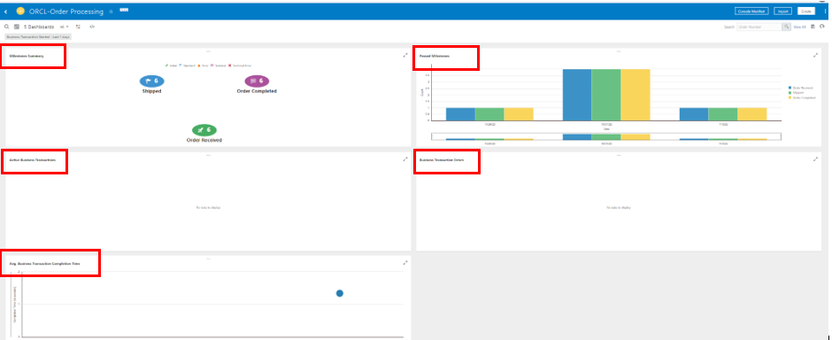

# Process Integration Test

## Introduction

The Lab will cover how to test the process integration mapped Milestones/Identifiers. How to view the test in the Insight Console and some of the standard dashboard views.

Estimated Time: 10 minutes

## Prerequisites

This lab assumes you have:

- Completed Labs 1 through 6

## Learning Objectives

In this lab, you will learn how to create the following:

- Console Views
- Standard Dashboards
- Map Testing

Insight automatically creates and associated Console when a model, with defined business processes, has been activated.

The Consoles page shows the status of all business processes and includes a high-level visualization of the metrics collected over the past day for all activated business processes.

Consoles can be accessed either fromm the Oracle Integration navigational pane or from the Insight tile on the Oracle Integration home page. Consoles names are the same as the Model name or Business Process that was mapped.

Double-click on a dashboard to open the Business Transaction Details dashboard for that dashboard. The following dashboards support drilling down into the transaction details:

- **Passed Milestones**: Double-click any milestone bar to show the business transactions (instances) that have passed that milestone.
- **Milestones Summary**: Double-click any milestone bubble to show the business transactions (instances) associated with the milestone.
- **Active Transactions**: Double-click any business transaction bar to show the active business transactions. Because a business transaction state may change between the time the dashboard displayed and the time you clicked a bar, you may not see the same business transactions on the Business Transaction Details dashboard.
- **Transaction Errors**: Double-click any slice on the pie chart to show the business transactions in Error state.
- **Avg. Transaction Completion Time**: Double-click any bubble on the bubble chart to show the business transactions in Successful or Failed state, depending on the bubble you clicked.

### Access the Console

    A. Go to Integration Insight    
        1. Click Insight
        2. Click Console
        3. Double Click the Console to reach the Dashboards
Testing your mappings is vital. Ensuring that the mapped item function correctly and provide needed information in the console.  

### Map Testing

    A.  Access Integrations  
        1. Hover over the Status and the Run icon (forward arrow) will appear
            a. Select from dropdown the Operation you wish to test. 
        2. Click on the icon and message box will appear, click on the word "Test"
        3. Now you need to configure your request properties.
            a. Under the Request area, click on Tab named "Body" 
            b. Click "File" and choose your saved file 
                OR 
            c. Click text and copy the json file information
        4. Click "Test", located far center right of screen
        5. You will receive a message box and then see the Activity stream 
            a. Activity stream will showcase in Ascending order and will show green, if successful
            b. Activity stream will showcase yellow or red, if unsuccessful

Now your turn to try!

 You will test you mapping and then view the results of the order in the created Console and Dashboard.

## Task 1: Test Mapping

1. Open the Integration named **Oracle Order Processing** in Test. Locate the drop down next to **Operation** and select ReceiveOrder(Post). Click on the tab named **Body**, notice that the information below is already displayed.

```
    <copy>
{  
"orderId": "1000",  
"product": "Laptop", 
"quantity": 5, 
"unitPrice": 1500,  
"discount": 0,  
"country": "US"  
} 
    </copy>
```

2. Click **Test**.  A confirmation will appear and the Activity Stream will display the Instance.
Notice how the Instance advises you via the green markers that it was successful. Yellow and Red markers will also display when an Instance is not successful and needs corrections.

## Task 2: Additional Orders and Test  

In order to have a robust example for the Console Dashboards, you will need additional orders. 

1. Download the sample from this link and save to your desktop or locale drive

2. Select **ReceiveOrder(Post)**

3. Select tab named **Body** and select **File**, Choose the json file you saved

4. Click **Test**. 

## Task 3: Insight Console View

Navigate to Insight and access the Console to view your Console named **My Order Process**. Click on Console Manifest to view the names of the dashboards. You will see both the dropdowns for the Dashboard names and the Filter Details which showcases the Milestones and the Identifier.

## Task 4: Dashboard View

Review the 5 Preconfigured Dashboards named **Milestone Summary**, **Passed Milestones**, **Active Business Transactions**, **Business Transaction**, **Errors** and **Avg. Business transaction Completion Time**.
Preconfigured Dashboards:



Congratulation on completing the Process Mapping Test and Console View.
You may now **proceed to the next lab**.

## Want to Learn More

More info on Insight Models can be found [here](https://docs.oracle.com/en/cloud/paas/integration-cloud/user-int-insight-oci/work-models-integration-insight.html).

## Acknowledgements

- **Author** - Lucy Cortez, Product Enablement Management - Oracle Integration
- **Last Updated By/Date** - Lucy Cortez, April 2022
